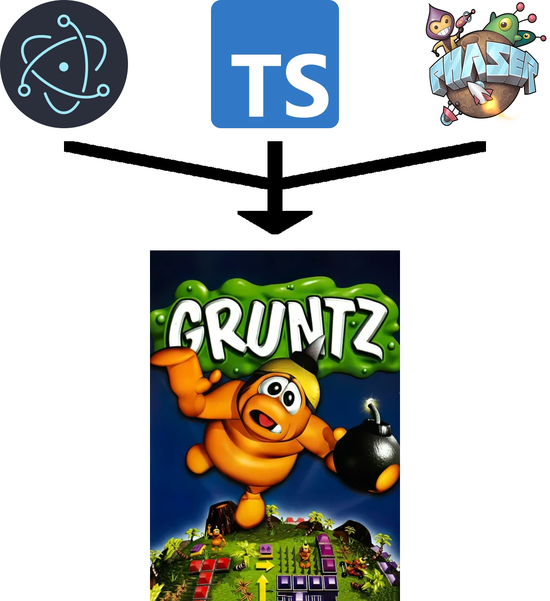

<h1 style="text-align: center;">Electronic Gruntz</h1>
<h2 style="text-align: center;">
    Welcome to the Electronic Gruntz homepage!
</h2>

    This project aims to be a complete remake of the original Gruntz game, which was developed and published in 1999 by Monolith Productions.

    

<section>
    <h2>The Idea</h2>
    

        The main motivation behind this project is to create a modern, open-source version of the game, which can be played on any platform.
    

    

        I am very excited about this project, I hope you'll like it as well! For details, just read on, for the game itself, <a>just download, install, and run!</a>. Happy gaming!
    

</section>
<section>
    <h2>The Issues</h2>
    

        The original game is mostly lacking in three key areas:
    

    <h3>
        1. Platform dependency
    </h3>
    

        The game was developed for Windows, neither Linux nor macOS is able to handle the game (at least natively). It has numerous problems even on newer versions of Windows.
    

    <h3>
        2. Extensibility (or lack thereof)
    </h3>
    

        It it only extensible to the point that players can create their own levels. You cannot add new tilesets, tools, toys, functionality or features  to the game.
    

    <h3>
        3. UI and Usability
    </h3>
    

        Time has left its mark both on the UI and on the level editor. In my opinion, they seem a bit clunky from today's perspective, need a facelift, and also to become more user-friendly.
    

</section>
<section>
    <h2>
        The Solutions
    </h2>
    

        This project has answers to these problems, and more!
    

    <h3>
        1. Platform dependency
    </h3>
    

        Contrary to previous projects like this, which tried to tackle the question of cross-platform support by using Java, I took another approach. I decided to harness the power of the great Interwebs! The Internet is one of the most rapidly evolving ecosystems in the world, and as such, it's never been easier to do great things with it! The project is developed on top of <a href="https://www.electronjs.org/">Electron</a>, a framework for building cross-platform applications with the help of web technologies. (The use of Electron has inspired the name of the project. Also, I think it sounds cool.)
    

    

        And even more, with Electron, we can make native, installable games for Windows, Linux, or macOS!
    

    <h3>
        2. Extensibility (or lack thereof)
    </h3>
    

        Extensibility can be achieved simply by using the modern tools we have! For example:
    

    

        You can make your own tilesets, animations, custom objects and whatnot using <a href="https://www.gimp.org/">GIMP</a>, which is a completely free image editing software, and for our purposes, not that hard to learn.
    

    

         You can create those incredible custom levelz you've been making for the past 20-something years now more easily with <a href="https://thorbjorn.itch.io/tiled">Tiled</a>, an intuitive, powerful, and easy to use level editor. It's also free, but I encourage you to support the developer, whose hard work makes this amazing piece of software going.
    

    

        As for introducing new logic to the game, I'll try my best to make this as extensible as possible, through the use of the <a href="https://phaser.io/">Phaser Game Framework</a> that makes life much easier for developers, with many built-in features and plugins, so that we can focus on the making of the game.
    

    <h3>
        3. UI/UX
    </h3>
    

        The Internet is a wonderful place, filled to the brim with beautiful websites, and even more beautiful people who make it all work. CSS is more powerful than ever, HTML is becoming better and better day by day. I think it will be a breeze to create a great UI for the game with such tools at our disposal, and they also allow for countless possibilities for creating custom UIs or extending an existing one.
    

    

        As for the level editor, we are very, very lucky with this one. I use <a href="https://thorbjorn.itch.io/tiled">Tiled</a>, a modern, feature-rich, powerful, and  easy to use level editor, with which you can create your own levels in no time! It allows the use of any kind of tilesets, there is no limit to map size, and has many, many more features.
    

</section>

